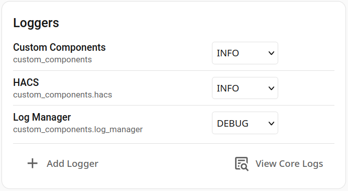
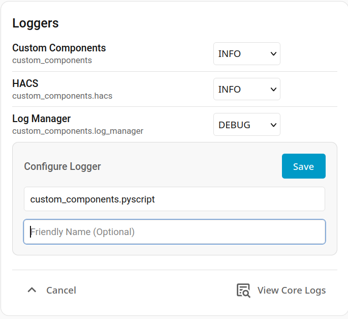

# Home Assistant Log Manager

A dynamic control panel for managing Python loggers in Home Assistant. This custom integration allows you to adjust log levels on the fly without restarting your server or modifying your `configuration.yaml` file.

## Features
* **Dynamic Log Levels:** Change logger levels (DEBUG, INFO, WARNING, ERROR, CRITICAL) instantly from the frontend.
* **Smart UI Card:** Includes a custom Lovelace card with fuzzy searching.
* **Persistent Configuration:** Active loggers and their levels are saved to Home Assistant storage and restored automatically on reboot.

## Installation

### Method 1: HACS (Recommended)
1. Open Home Assistant and navigate to **HACS**.
2. Click the three dots in the top right corner and select **Custom repositories**.
3. Add the URL to this GitHub repository and select **Integration** as the category.
4. Click **Add**, then locate "Log Manager" in HACS and click **Download**.
5. Restart Home Assistant.

### Method 2: Manual
1. Download the latest release from this repository.
2. Copy the `custom_components/log_manager` directory into your Home Assistant `/config/custom_components/` directory.
3. Restart Home Assistant.

## Configuration
1. Go to **Settings** -> **Devices & Services**.
2. Click **+ Add Integration** in the bottom right.
3. Search for "Log Manager" and follow the UI prompts to initialize the integration.

## Dashboard Setup
To manage your loggers, add the custom card to your Lovelace dashboard:
1. Navigate to your dashboard and click **Edit Dashboard**.
2. Click **Add Card**.
3. Search for **Log Manager** or manually add the following YAML:

\`\`\`yaml
type: custom:log-manager-card
\`\`\`

