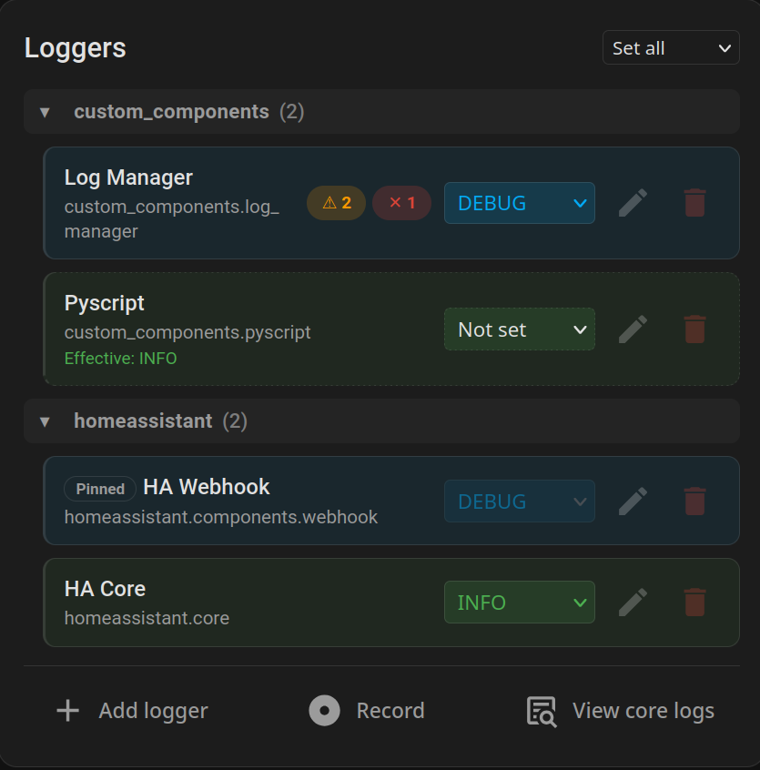
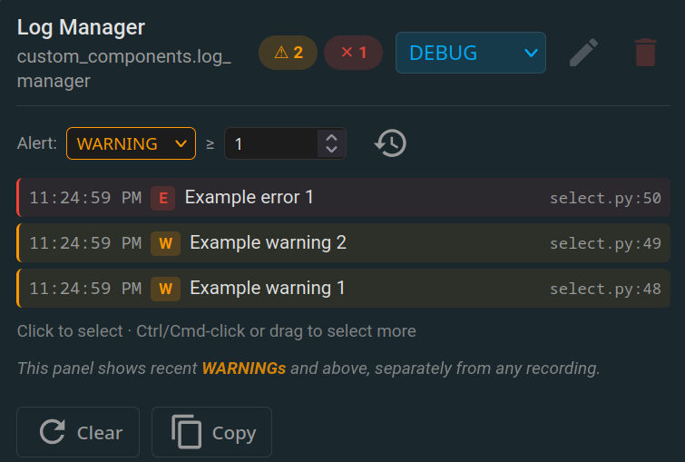
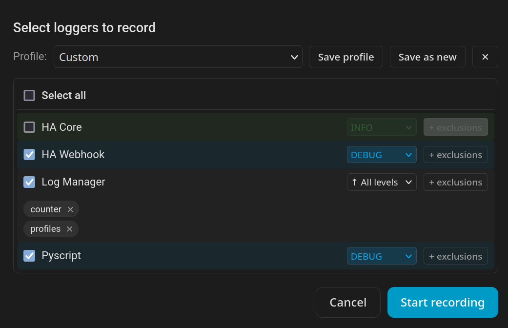
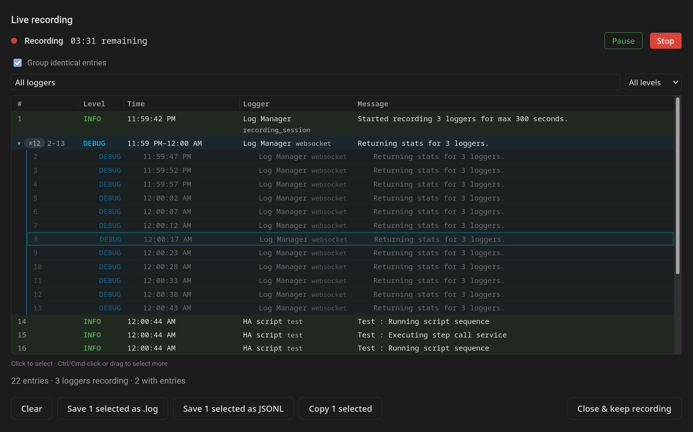
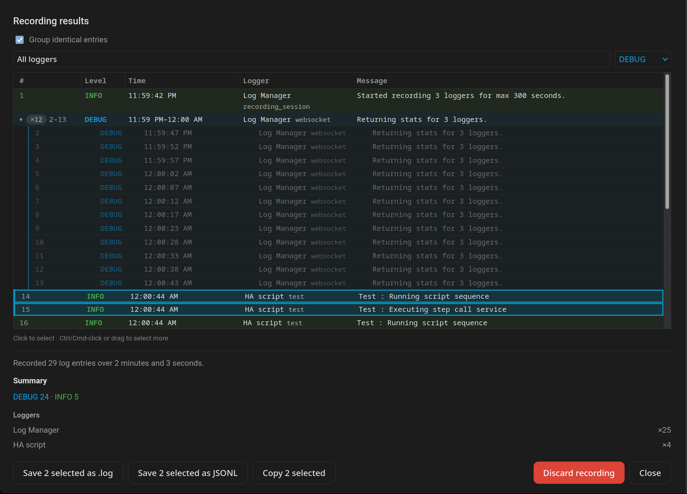
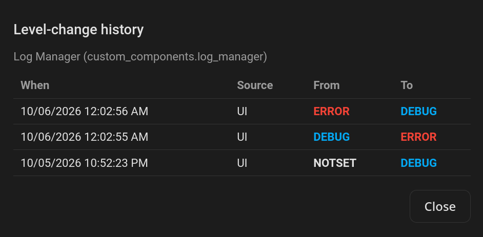

# Home Assistant Log Manager

A dynamic control panel for managing Python loggers in Home Assistant. This custom integration allows you to adjust log levels on the fly without restarting your server or modifying your `configuration.yaml` file.

## Features
### Dynamic Log Levels
Change logger levels (DEBUG, INFO, WARNING, ERROR, CRITICAL) instantly from the frontend.

### Bulk "Set all" level
A selector in the card header applies one level to every managed logger at once. Loggers pinned by Home Assistant core are skipped and reported, and the control is locked while a recording is active.

### Warning/Error Counters
Counts WARNING and above per managed logger, shown as badges on each logger row with an expandable panel of the most recent matching log entries. Reset counters per logger or for all loggers.

### Fixed counting severity
Counting is always WARNING and above — there is no configurable counting level. The expanded panel lists the WARNING-and-above entries behind the badges; the former INFO-audit workflow (lower the counting level to capture INFO traffic) is gone. This removes the `log_manager.set_count_level` service as a breaking change.

### Severity alerts
Each logger can notify once when it logs a configurable number of counted events at or above a chosen severity (WARNING, ERROR or CRITICAL). The notification names the logger and links to the HA Logs page; the alert can be set to DISABLED, and resetting the counters dismisses the notification and re-arms it. Set the severity you consider critical per logger — narrow loggers can alert on warnings, broad ones stay on errors.

### Level-change audit trail
Each logger records level changes with their origin — card or service selection — shown in a Level-change history dialog opened from the expanded panel.

### Core logger sync
Levels pinned by Home Assistant itself (YAML `logger:` block, an integration's debug toggle, or the `logger.set_level` service) are adopted automatically and shown as read-only "Pinned" rows — the card never displays a level it cannot actually apply.

### Effective-level display
Loggers left at `NOTSET` show the level that actually applies, resolved through inheritance — e.g. `effective: DEBUG` with the defining ancestor in the tooltip — so there is never doubt about what is in force.

### Live Log Recording
Record log output from selected loggers for up to an hour, preview it in real time, then stop to review. Capture levels range from `ALL` — everything the logger emits, including custom numeric levels — down through DEBUG, INFO, WARNING, ERROR and CRITICAL. Noisy child loggers can be excluded per selected logger. Export the captured entries as a plain-text `.log` file, JSON Lines (`.jsonl`), or copy them to the clipboard. Recorded sessions stay available until you explicitly discard them, and a recording logger's level, edit and delete controls are locked while the session runs.

### Recording level-raise consent
When a logger is selected at a level more verbose than its configured level — or a saved profile is loaded with one — the card asks for consent first. An accepted raise is applied when the session starts and automatically reverted when it ends, with a "Raised to X" marker shown on the row meanwhile.

### Entry selection & selective export
Click an entry to select it, Ctrl/Cmd-click to add or remove one, and Shift-click or drag to select a range — in the expanded logger panel, the live view and the results view. Copy and Save then act on just the selected entries (labelled "Copy 3 selected" / "Save 3 selected as …"), or on the whole list when nothing is selected.

### Right-click menus
The card replaces the browser context menu with its own on logger rows, captured entries, the recording checklist, history rows and counter badges — offering actions such as Copy logger path, Copy entry, Copy selected entries and Copy all history. The results summary and live status offer Copy and Select-all; text fields keep the native menu.

### Counter sensors
Every managed logger automatically exposes its warning/error counts as sensor entities for history and automations.

### Recording profiles
Save a recording setup — logger selection, per-logger levels, duration and per-logger child exclusions — under a name and rerun it later from the card or from automations via `log_manager.start_recording` with a profile name. "Save profile" overwrites the shown profile, while "Save as new" creates another.

### Searchable logger filter
The live and results views filter by a searchable, multi-select list of the loggers actually present in the buffer; the ticked set is remembered for the session, and ticking a logger never implies its children.

### Logger grouping
The card groups managed loggers by namespace prefix into collapsible sections (on by default; set `group_by_prefix: false` in the card config for a flat list).

### Live-view dedup
Identical consecutive entries in the live view and results fold into one expandable row with a count and time range. Grouping is on by default; set `live_dedup: false` in the card config to start with the raw stream instead. The "Group identical entries" checkbox in the recording window overrides that default for the current session only — the choice is not persisted, so reloading the card restores the configured setting.

### Locale-aware timestamps
Every date and time the card renders — entry rows, group ranges, the history dialog, copies and download filenames — follows Home Assistant's configured regional date and 12/24-hour format.

### Results summary
Ended sessions show severity totals and the top loggers for the currently filtered entries in a read-only summary below the entry list.

### Smart UI Card
Includes a custom Lovelace card with fuzzy searching.

### Persistent Configuration
Active loggers and their levels are saved to Home Assistant storage and restored automatically on reboot.

## Screenshots

### Managed loggers
Grouped logger rows with counter badges, effective-level and pinned chips, and the header **Set all** control.


### Expanded logger panel
Recent WARNING-and-above entries, the alert controls, and the level-change history button.


### Recording setup
Logger checklist with per-logger capture levels, exclusion chips, and the profile save/load controls.


### Live recording
Streaming entries with dedup grouping, the logger filter, and selection-aware export.


### Recording results
Severity totals and top loggers for the finished session, with selection-aware save buttons.


### Level-change history
Every level change with its source and timestamp.


## Services
The integration exposes the following services (callable from automations and the developer tools):
* `log_manager.add_logger` — Control a new logger, optionally with a friendly name.
* `log_manager.remove_logger` — Stop controlling a managed logger.
* `log_manager.reset_counters` — Reset warning/error counters, for a single logger or all loggers.
* `log_manager.set_alert_threshold` — Notify after a managed logger logs a configurable number of events at or above a chosen severity.
* `log_manager.start_recording` — Start capturing log events, with an explicit logger list or a saved profile name.
* `log_manager.stop_recording` — Stop the active recording session, retaining its captured events. Returns the captured logs when called with a response, and always fires a `log_manager_recording_completed` event with the session summary.
* `log_manager.discard_recording` — Discard the active or completed recording session.

## Installation

### Method 1: HACS (Recommended)
1. Open Home Assistant and navigate to **HACS**.
2. Click the three dots in the top right corner and select **Custom repositories**.
3. Add the URL to this GitHub repository and select **Integration** as the category.
4. Click **Add**, then locate "Log Manager" in HACS and click **Download**.
5. Restart Home Assistant.

### Method 2: Manual
1. Download the latest release from this repository.
2. Copy the `custom_components/log_manager` directory into your Home Assistant `/config/custom_components/` directory.
3. Restart Home Assistant.

## Configuration
1. Go to **Settings** -> **Devices & Services**.
2. Click **+ Add Integration** in the bottom right.
3. Search for "Log Manager" and follow the UI prompts to initialize the integration.

## Dashboard Setup
To manage your loggers, add the custom card to your Lovelace dashboard:
1. Navigate to your dashboard and click **Edit Dashboard**.
2. Click **Add Card**.
3. Search for **Log Manager** or manually add the following YAML:

```yaml
type: custom:log-manager-card
# Optional card options:
group_by_prefix: true   # group loggers by namespace prefix (default: true)
live_dedup: true        # fold identical consecutive entries (default: true)
```

Set either option to `false` to opt out of that behaviour.

The integration registers the card's Lovelace resource automatically when it loads, so there is no JavaScript URL to add by hand — only the card itself.

