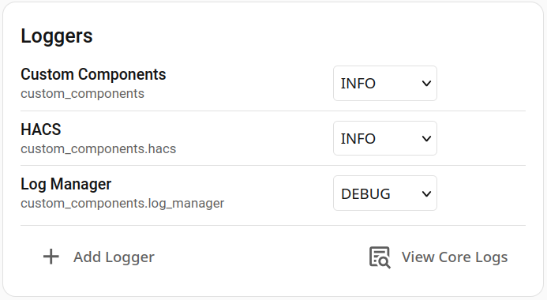
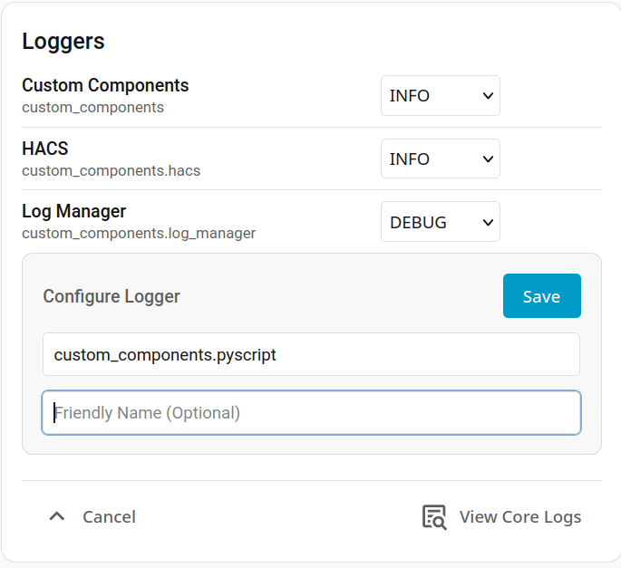

# Home Assistant Log Manager

A dynamic control panel for managing Python loggers in Home Assistant. This custom integration allows you to adjust log levels on the fly without restarting your server or modifying your `configuration.yaml` file.

## Features
* **Dynamic Log Levels:** Change logger levels (DEBUG, INFO, WARNING, ERROR, CRITICAL) instantly from the frontend.
* **Warning/Error Counters:** Counts WARNING and above per managed logger, shown as badges on each logger row with an expandable panel of the most recent matching log entries. Reset counters per logger or for all loggers.
* **Per-logger counting levels:** Each logger counts events at or above its own configurable level (default WARNING). Lower it to INFO during an audit and the badges and expanded panel start reflecting INFO traffic; the panel also shows a per-severity breakdown of everything counted. Thresholds apply to new events only — reset the counters for a clean slate after changing one.
* **Severity alerts:** Each logger can notify once when it logs a configurable number of counted events at or above a chosen severity (WARNING, ERROR or CRITICAL). The notification names the logger and links to the HA Logs page; resetting the counters re-arms it. Set the severity you consider critical per logger — narrow loggers can alert on warnings, broad ones stay on errors.
* **Level-change audit trail:** Each logger records level changes with their origin — card or service selection — shown as a compact history line in the expanded panel.
* **Core logger sync:** Levels pinned by Home Assistant itself (YAML `logger:` block, an integration's debug toggle, or the `logger.set_level` service) are adopted automatically and shown as read-only "Pinned" rows — the card never displays a level it cannot actually apply.
* **Effective-level display:** Loggers left at `NOTSET` show the level that actually applies, resolved through inheritance — e.g. `effective: DEBUG` with the defining ancestor in the tooltip — so there is never doubt about what is in force.
* **Live Log Recording:** Record log output from selected loggers for up to an hour, preview it in real time, then stop to review. Noisy child loggers can be excluded per selected logger. Export the captured entries as a plain-text `.log` file, JSON Lines (`.jsonl`), or copy them to the clipboard. Recorded sessions stay available until you explicitly discard them.
* **Counter sensors:** Each logger can expose its warning/error counts as sensor entities for history and automations. Opt-in per row via the Sensors toggle in the expanded panel — off by default to avoid entity clutter.
* **Recording profiles:** Save a recording setup — logger selection, per-logger levels and duration — under a name and rerun it later from the card or from automations via `log_manager.start_recording` with a profile name.
* **Logger grouping:** The card groups managed loggers by namespace prefix into collapsible sections (on by default; set `group_by_prefix: false` in the card config for a flat list).
* **Live-view dedup:** Identical consecutive entries in the live view and results fold into one expandable row with a count and time range (on by default; set `live_dedup: false` in the card config for the raw stream).
* **Smart UI Card:** Includes a custom Lovelace card with fuzzy searching.
* **Persistent Configuration:** Active loggers and their levels are saved to Home Assistant storage and restored automatically on reboot.

## Services
The integration exposes the following services (callable from automations and the developer tools):
* `log_manager.add_logger` — Control a new logger, optionally with a friendly name.
* `log_manager.remove_logger` — Stop controlling a managed logger.
* `log_manager.reset_counters` — Reset warning/error counters, for a single logger or all loggers.
* `log_manager.set_count_level` — Set the counting threshold for a managed logger.
* `log_manager.set_alert_threshold` — Notify after a managed logger logs a configurable number of events at or above a chosen severity.
* `log_manager.set_sensor_enabled` — Enable or disable the warning/error counter sensors for a managed logger.
* `log_manager.start_recording` — Start capturing log events, with an explicit logger list or a saved profile name.
* `log_manager.stop_recording` — Stop the active recording session, retaining its captured events. Returns the captured logs when called with a response, and always fires a `log_manager_recording_completed` event with the session summary.
* `log_manager.discard_recording` — Discard the active or completed recording session.

## Installation

### Method 1: HACS (Recommended)
1. Open Home Assistant and navigate to **HACS**.
2. Click the three dots in the top right corner and select **Custom repositories**.
3. Add the URL to this GitHub repository and select **Integration** as the category.
4. Click **Add**, then locate "Log Manager" in HACS and click **Download**.
5. Restart Home Assistant.

### Method 2: Manual
1. Download the latest release from this repository.
2. Copy the `custom_components/log_manager` directory into your Home Assistant `/config/custom_components/` directory.
3. Restart Home Assistant.

## Configuration
1. Go to **Settings** -> **Devices & Services**.
2. Click **+ Add Integration** in the bottom right.
3. Search for "Log Manager" and follow the UI prompts to initialize the integration.

## Dashboard Setup
To manage your loggers, add the custom card to your Lovelace dashboard:
1. Navigate to your dashboard and click **Edit Dashboard**.
2. Click **Add Card**.
3. Search for **Log Manager** or manually add the following YAML:

```yaml
type: custom:log-manager-card
```




